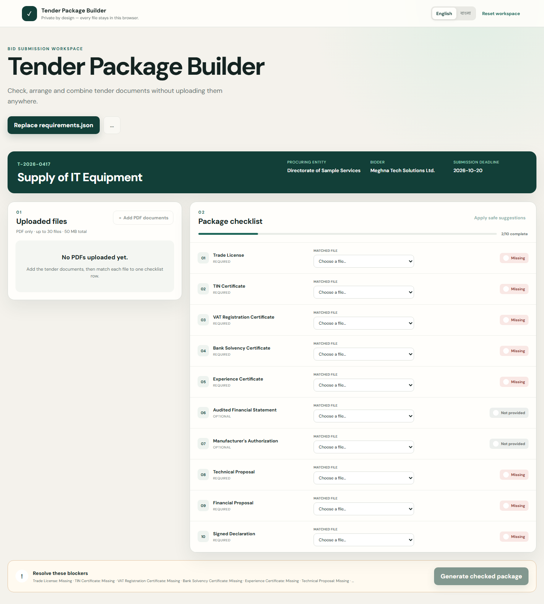

# Tender Document Package Builder

A bilingual, browser-only workspace that helps office staff check, arrange, and combine tender documents into a correctly ordered submission PDF. Files never leave the user's browser.

**Participant:** Tanvir Ahmed Siddique  
**Registration:** 24201056

## Repository

https://github.com/tanvir-ahmed-siddique-ctrl/DEVFEST-TANVIR-AHMED-SIDDIQUE-24201056-

## Live site

https://devfest-24201056-tanvirahmedsiddique-prsc5x1e5.vercel.app

## 60-second judge tour

1. Select **Load sample workspace**.
2. Confirm that `company_logo.png` is rejected and both experience certificates are marked **Duplicate**.
3. The known sample acceptance-oracle files and valid dates are selected automatically; optional R06/R07 remain unselected.
4. Switch to বাংলা and verify that labels, statuses, errors, and blocker explanations change language.
5. Generate and download `T-2026-0417_Package.pdf`.

## Completed main features

- Validated `requirements.json` loading with stable ordering by the `order` field.
- Multi-PDF upload, page counts, thumbnails, removal, and clear rejection messages.
- SHA-256 exact-content duplicate detection, independent of file names.
- One-to-one file matching with duplicate cross-match prevention and undo/change support.
- Immediate `Missing`, `Expiry date needed`, `Expired`, `Not provided`, and `OK` statuses.
- Deadline-boundary correctness: expiry on the deadline is valid.
- Generate button blockers with requirement-specific reasons.
- English cover, original document page order, and a reserved footer strip on every page.
- Complete Bangla/English application interface, including errors and statuses.
- Responsive layout and reduced-motion support.
- Safe handling of non-PDF, damaged, and password-protected input.

## Bonus features

- Page thumbnails, including image-only scans.
- Filename-based auto-match suggestions that refuse ambiguous matches.
- Built-in sample workspace for quick judging.
- Optional index page. It stays off unless selected, so the supplied sample package remains 16 pages.
- Checklist export as CSV.
- Save and reopen the workspace in this browser.
- A PNG seal placed only on the cover or documents the user selects.
- Bangla titles on the English cover when this browser can draw them.
- An optional desk helper. It answers from the open tender, and it reads matched PDFs only after the user allows it. A Gemini key can be typed into the helper for a fuller answer. The key stays in that browser session and is never stored in this repository. Generating the package does not depend on it.
- Guided example questions and a separate AI settings view. API keys live only in React memory and disappear on refresh or tab close.
- Double-click a checklist row to clear that match.
- Drag PDF files onto the file list.

## Sample output

The repository includes [`output/T-2026-0417_Package.pdf`](output/T-2026-0417_Package.pdf), generated from the corrected sample selection. Without an optional index page it has 16 pages, ordered by requirement rather than filename.



## Run locally

Requirements: Node.js 22+ and pnpm 11+.

```bash
pnpm install
pnpm dev
```

Verification:

```bash
pnpm test
pnpm build
pnpm generate:sample
```

Container preview:

```bash
docker build -t tender-package-builder .
docker run --rm -p 8080:80 tender-package-builder
```

## Architecture

- React + TypeScript + Vite
- `pdfjs-dist` for safe browser-side inspection, page counts, and thumbnails
- Web Crypto SHA-256 for exact duplicate detection
- `pdf-lib` for the cover, ordered merge, reserved footer strip, and download
- Vitest for compliance and edge-case tests
- Multi-stage Docker build with an unprivileged static application surface behind nginx

Core rule evaluation is isolated from React in `src/engine/compliance.ts`. Display strings are translated only in the UI layer, so status behavior remains identical in both languages.

## Known limitations

- The required cover stays in English. Bangla titles are added only when the browser can draw them.
- The desk helper cannot answer a question that is not present in the open tender or the matched files.
- A container file is included only to serve the built website. The tender checks and the PDF are still made in the browser.
- The live site appears after the Vercel project publishes the latest build.

## AI use

Cursor was used for requirements analysis, implementation, testing, PDF generation, and documentation. The main implementation prompt was: “Build a browser-only bilingual desk that checks tender PDFs for expiry and duplicates, then generates one correctly ordered package with an English cover and a footer on every page.”

All document processing is deterministic and works without an AI service or API key.

